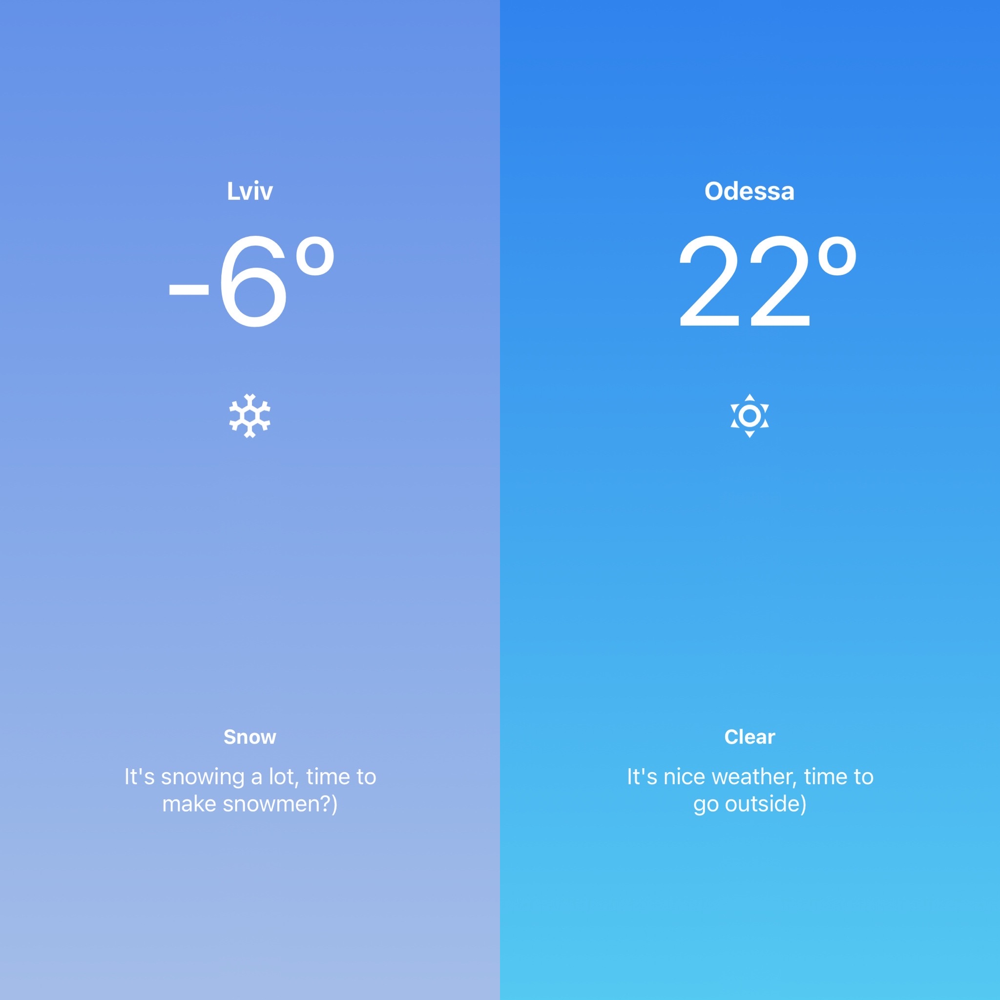
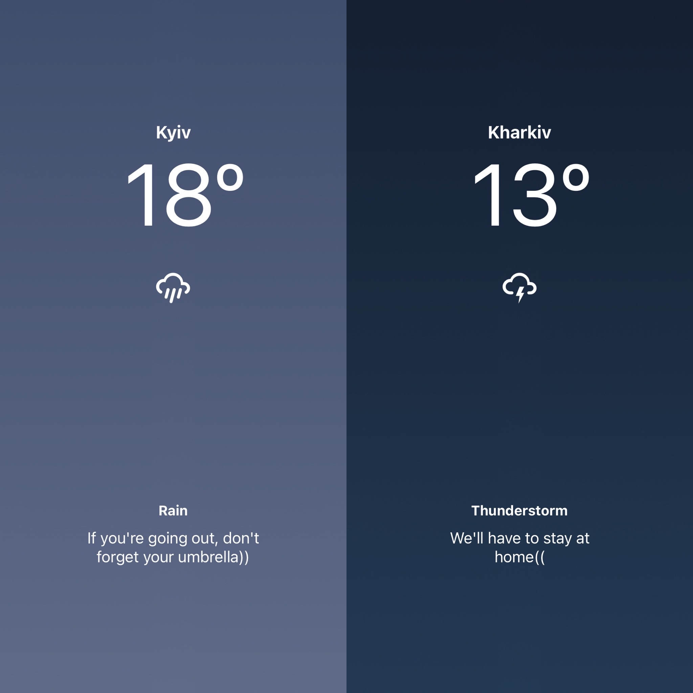
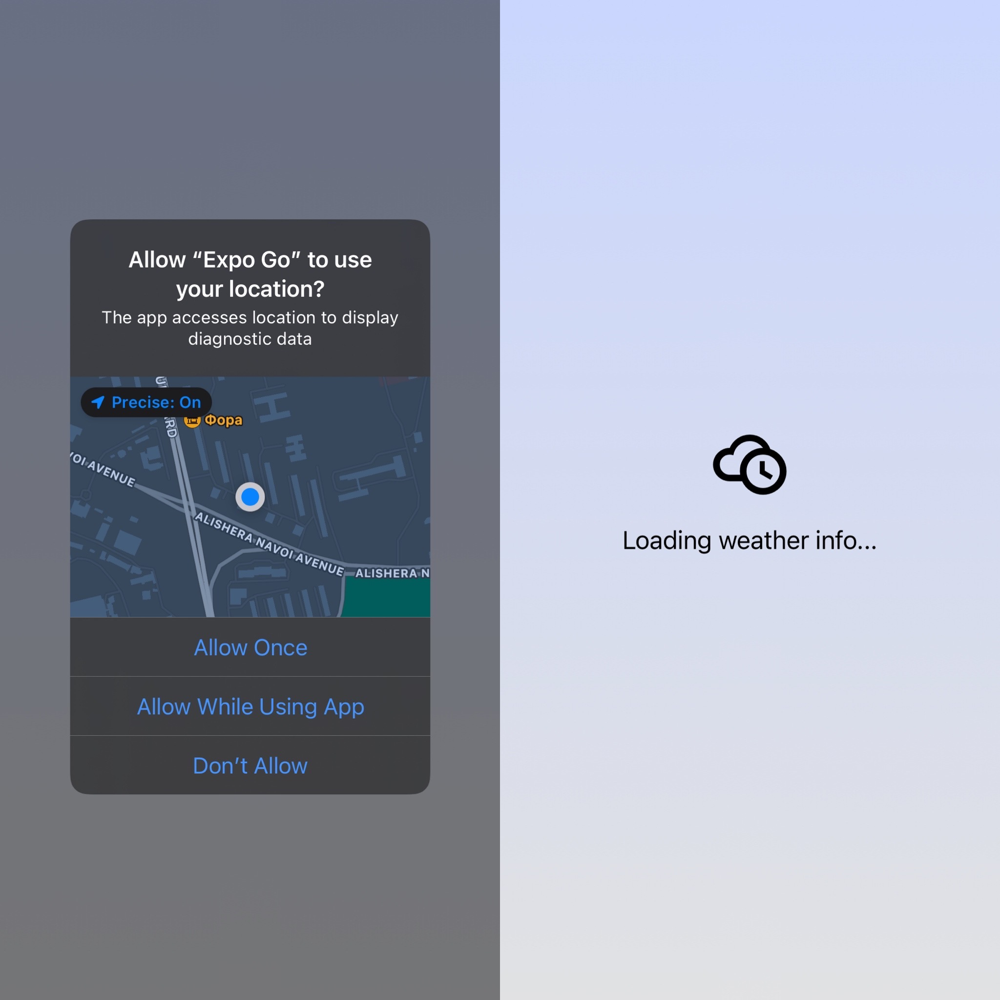
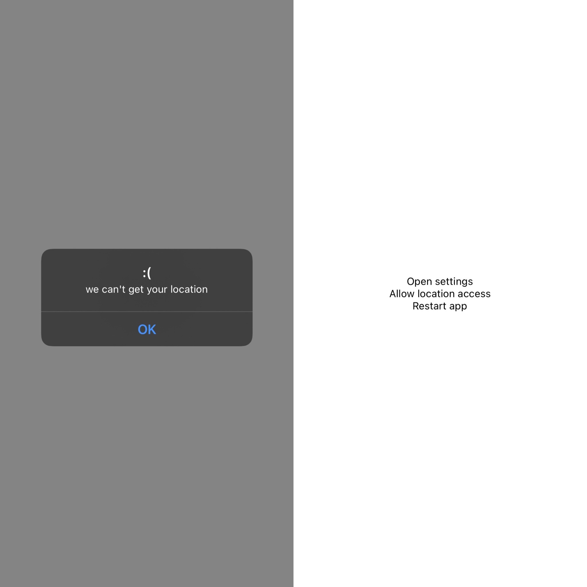

## ☁️ weather-app

#### With this simple app you can find out the current weather in your area

#### It looks like this: 👇

<div style="display: flex">
    
    
</div>

#### This app will recognize your geolocation and load up-to-date weather information for you 
(If it fails, you will receive notification and proposition to fix it in the settings)

<div style="display: flex">
    
    
</div>

### Stack:
* React Native
* JavaScript
* expo-cli
* axios

### How to start:
* Fork and clone this repo
* Run ```npm install```
* Run ```npm start```
* Follow the instructions in terminal
